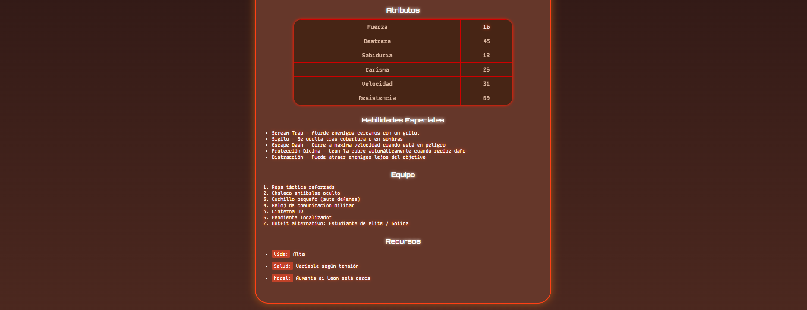

### Ficha de personaje de Resident Evil 4 Remake ​​

# **Ashley Graham**


<br>


Tarjeta interactiva del personaje Ashley Graham con efectos visuales inspirados en Resident Evil 4 Remake.

# ​👩‍💻​ Tecnologias utilizadas ​


## ​🎨​ Pleta de Colores

| Color               | Uso Principal           |
|---------------------|-------------------------|
| `#221111` `#4c281f`           | Fondo difuminado                   |
| `#65372a`           | card principal                  |
| `#ff4015`           | Borde de card principal                  |
| `#ffffff`           | Titulos           |
| `#f4e8e1`           | Text-shadow (titulos)                 |
| `#442312e2`           | background-color tabla      |
| `#ff1900`           |  box-shadow tabla      |


## 🧩 Estructura de Archivos

```
TIPOGRAFIA/
├── ashley.jpg
├── infocard.jpg
├── grupal.png
├── index.html
├── logo.png
├── superior.jpg
├── README.md
├── styles.css
└── transicion.png
```

## 📄 Licencia

Este proyecto está bajo la licencia MIT. Siéntete libre de usarlo, modificarlo y distribuirlo.


